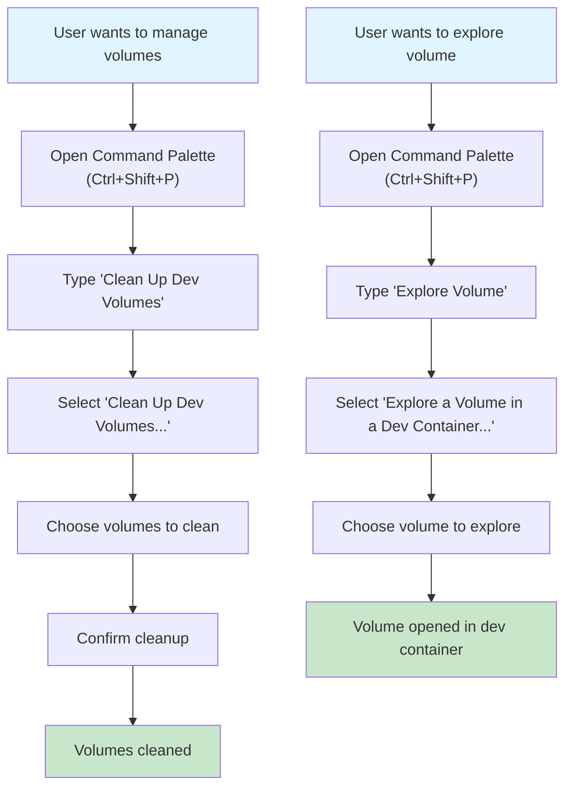
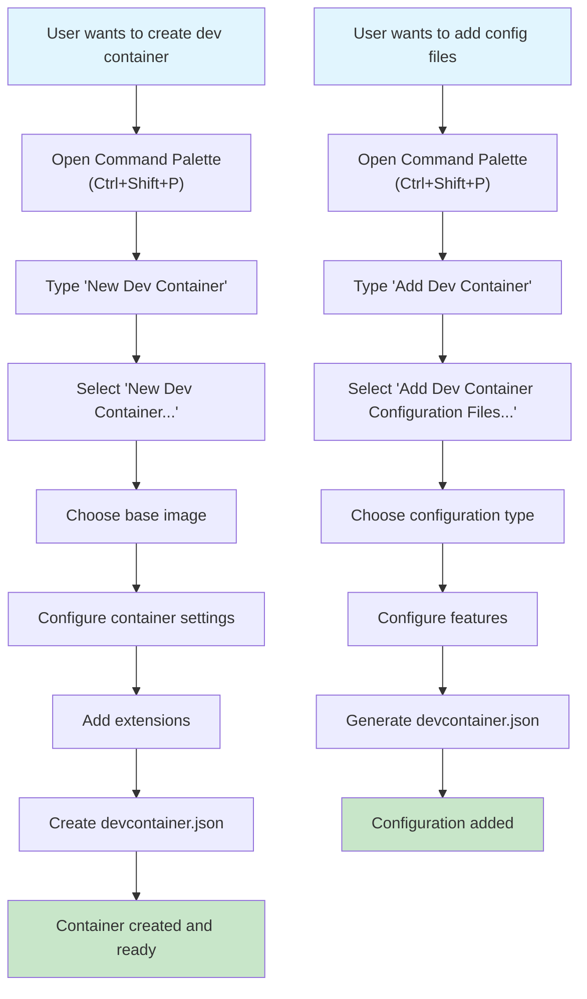
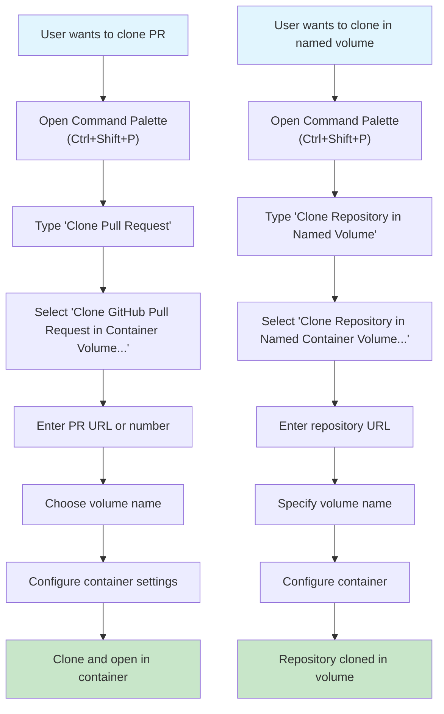
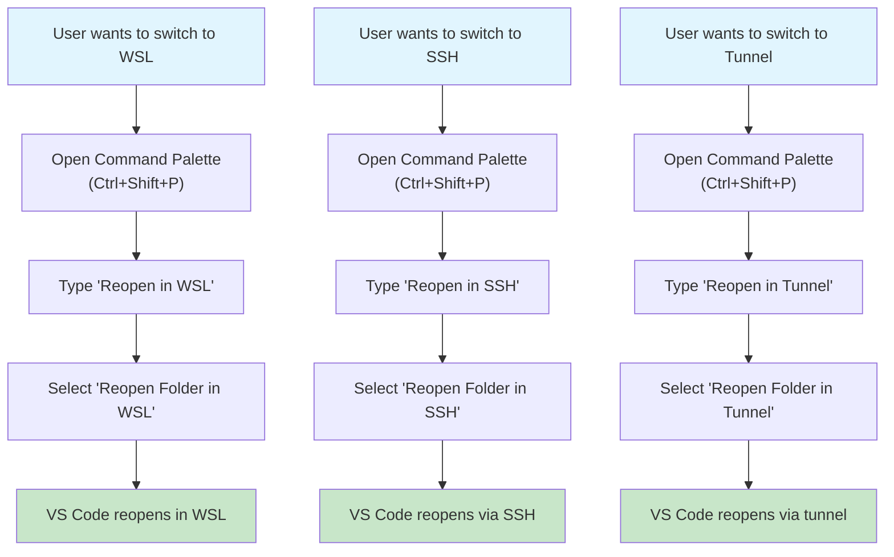

# DevContainer Commands Reference & Discovery Analysis

This document contains the complete analysis of DevContainer commands, including VS Code commands, Cursor-specific commands, missing functionality, and detailed dependency analysis.

## Table of Contents

1. [VS Code Dev Container Commands](#vs-code-dev-container-commands)
2. [Cursor Dev Container Commands](#cursor-dev-container-commands)
3. [Missing Commands Analysis](#missing-commands-analysis)
4. [User Journeys for Missing Commands](#user-journeys-for-missing-commands)
5. [Discovery Analysis](#discovery-analysis)
6. [Dependency Trees](#dependency-trees)

---

# VS Code Dev Container Commands

This section contains all available dev container commands in VS Code, organized by their availability in the command palette and context menus.

## Commands Available in Command Palette

| Command ID | Title | Keyboard Shortcuts | Menu Contexts |
|------------|-------|-------------------|---------------|
| `remote-containers.attachToK8sContainer` | Attach to Running Kubernetes Container... | | commandPalette |
| `remote-containers.cleanUpDevContainers` | Clean Up Dev Containers... | | commandPalette view/title |
| `remote-containers.configureContainerFeatures` | Configure Container Features... | | commandPalette statusBar/remoteIndicator |
| `remote-containers.createDevContainer` | New Dev Container... | | commandPalette statusBar/remoteIndicator |
| `remote-containers.createDevContainerFile` | Add Dev Container Configuration Files... | | commandPalette statusBar/remoteIndicator |
| `remote-containers.createDevContainerFileWithCopilot` | Add Dev Container Configuration Files using GitHub Copilot... | | commandPalette |
| `remote-containers.getHelp` | Help | | commandPalette |
| `remote-containers.getStarted` | Get Started with Dev Containers | | commandPalette |
| `remote-containers.inspectVolume` | Explore a Volume in a Dev Container... | | commandPalette |
| `remote-containers.installDocker` | Install Docker | | commandPalette |
| `remote-containers.installDockerInWSL` | Install Docker in WSL | | commandPalette |
| `remote-containers.installUserCLI` | Install devcontainer CLI | | commandPalette |
| `remote-containers.openAttachConfigByNameFile` | Open Named Container Configuration File | | commandPalette |
| `remote-containers.openAttachDevContainerFile` | Open Attached Container Configuration File... | | commandPalette |
| `remote-containers.openDevContainerFile` | Open Container Configuration File | | commandPalette statusBar/remoteIndicator view/item/context view/title |
| `remote-containers.openFolder` | Open Folder in Container... | | commandPalette statusBar/remoteIndicator |
| `remote-containers.openLastLogFile` | Show Previous Log | | commandPalette |
| `remote-containers.openLogFile` | Show All Logs... | | commandPalette |
| `remote-containers.openPullRequestInVolume` | Clone GitHub Pull Request in Container Volume... | | commandPalette |
| `remote-containers.openRepositoryInUniqueVolume` | Clone Repository in Container Volume... | | commandPalette statusBar/remoteIndicator view/title |
| `remote-containers.openRepositoryInVolume` | Clone Repository in Named Container Volume... | | commandPalette |
| `remote-containers.openWorkspace` | Open Workspace in Container... | | commandPalette |
| `remote-containers.provideFeedback` | Provide Feedback | | commandPalette |
| `remote-containers.pruneVolumes` | Clean Up Dev Volumes... | | commandPalette view/title |
| `remote-containers.rebuildAndReopenInContainer` | Rebuild and Reopen in Container | | commandPalette |
| `remote-containers.rebuildContainer` | Rebuild Container | | commandPalette statusBar/remoteIndicator view/item/context view/title |
| `remote-containers.rebuildContainerNoCache` | Rebuild Container Without Cache | | commandPalette |
| `remote-containers.rebuildNoCacheAndReopenInContainer` | Rebuild Without Cache and Reopen in Container | | commandPalette |
| `remote-containers.reopenInContainer` | Reopen in Container | | commandPalette statusBar/remoteIndicator |
| `remote-containers.reopenInSSH` | Reopen Folder in SSH | | commandPalette statusBar/remoteIndicator view/item/context |
| `remote-containers.reopenInTunnel` | Reopen Folder in Tunnel | | commandPalette statusBar/remoteIndicator view/item/context |
| `remote-containers.reopenInWSL` | Reopen Folder in WSL | | commandPalette statusBar/remoteIndicator view/item/context |
| `remote-containers.reopenLocally` | Reopen Folder Locally | | commandPalette statusBar/remoteIndicator view/item/context |
| `remote-containers.reportIssue` | Report Issue... | | commandPalette |
| `remote-containers.revealLogTerminal` | Show Container Log | | commandPalette |
| `remote-containers.settings` | Settings | | commandPalette |
| `remote-containers.showRecoveryContainerNotificationReset` | Reset Don't Show Recovery Container Notification | | commandPalette |
| `remote-containers.showReopenInContainerNotificationReset` | Reset Don't Show Reopen Notification | | commandPalette |
| `remote-containers.switchContainer` | Switch Container | | commandPalette |
| `remote-containers.testConnection` | Test Connection | | commandPalette |
| `remote-containers.trySample` | Try a Dev Container Sample... | | commandPalette |

## Commands Available in Context Menus Only

| Command ID | Title | Keyboard Shortcuts | Menu Contexts |
|------------|-------|-------------------|---------------|
| `remote-containers.addExtensionToConfig` | Add to devcontainer.json | | extension/context |
| `remote-containers.attachToContainerInCurrentWindow` | Attach in Current Window | | view/item/context |
| `remote-containers.attachToContainerInNewWindow` | Attach in New Window | | view/item/context view/title |
| `remote-containers.attachToK8sContainerFromViewlet` | Attach Visual Studio Code | | view/item/context |
| `remote-containers.attachToRunningContainerFromViewlet` | Attach Visual Studio Code | | view/item/context |
| `remote-containers.checkoutPRInVolume` | Checkout Pull Request in Dev Container | | view/item/context |
| `remote-containers.cloneInVolume` | Clone Repository in Volume | | view/item/context |
| `remote-containers.cloneInVolumeFromViewlet` | Clone into existing Volume | | |
| `remote-containers.explorerDetailsRefresh` | Refresh | | view/title |
| `remote-containers.explorerTargetsRefresh` | Refresh | | view/title |
| `remote-containers.explorerVolumesRefresh` | Refresh | | view/title |
| `remote-containers.inspectDockerResource` | Inspect | | view/item/context |
| `remote-containers.inspectInBasicDevContainer` | Explore in Dev Container | | view/item/context |
| `remote-containers.inspectVolumeFromViewlet` | Explore in a Dev Container | | view/item/context |
| `remote-containers.labelPortAndUpdateConfig` | Set Label and Update devcontainer.json | | ports/item/port/inline |
| `remote-containers.newContainer` | New Dev Container | | view/title |
| `remote-containers.openFolderInContainerInCurrentWindow` | Open in Container in Current Window | | view/item/context |
| `remote-containers.openFolderInContainerInNewWindow` | Open in Container in New Window | | view/item/context |
| `remote-containers.openInformationAboutMountPerformance` | Clone repository in Docker volume for better I/O performance. | | view/item/context |
| `remote-containers.openRepositoryFromGitWithEditSession` | Clone Repository in a Container Volume | | |
| `remote-containers.openRepositoryFromRemoteHubWithEditSession` | Clone Repository in a Container Volume | | |
| `remote-containers.removeContainer` | Remove Container | | view/item/context |
| `remote-containers.removeRecentFolder` | Remove Recent Folder | | view/item/context |
| `remote-containers.removeVolume` | Remove | | view/item/context |
| `remote-containers.showContainerLog` | Show Container Log | | view/item/context |
| `remote-containers.showDetails` | Show Details | | view/item/context |
| `remote-containers.startContainer` | Start Container | | view/item/context |
| `remote-containers.stopContainer` | Stop Container | | view/item/context |
| `workbench.action.closeFolder` | | | view/item/context |

## Notes

- Commands marked with `commandPalette` are accessible via the Command Palette (Ctrl+Shift+P / Cmd+Shift+P)
- Commands with `view/item/context` appear in right-click context menus
- Commands with `statusBar/remoteIndicator` appear in the status bar remote indicator
- Commands with `view/title` appear in view title bars
- Some commands are available in multiple contexts

---

# Cursor Dev Container Commands

This section contains all available dev container commands specifically in Cursor, organized by their availability in the command palette and context menus.

## Cursor Commands Available in Command Palette

| Command ID | Title | Keyboard Shortcuts | Menu Contexts |
|------------|-------|-------------------|---------------|
| `remote-containers.attachToK8sContainer` | Attach to Running Kubernetes Container... | | commandPalette statusBar/remoteIndicator |
| `remote-containers.attachToRunningContainer` | Attach to Running Container | | commandPalette statusBar/remoteIndicator |
| `remote-containers.killServerAndReload` | Kill Remote Server and Reload Window | | commandPalette statusBar/remoteIndicator |
| `remote-containers.openAttachConfigByNameFile` | Open Named Container Configuration File | | commandPalette |
| `remote-containers.openAttachDevContainerFile` | Open Attached Container Configuration File | | commandPalette |
| `remote-containers.openDevContainerFile` | Open Container Configuration File | | commandPalette statusBar/remoteIndicator view/item/context view/title |
| `remote-containers.openFolder` | Open Folder in Container | | commandPalette statusBar/remoteIndicator view/title |
| `remote-containers.rebuildAndReopenInContainer` | Rebuild and Reopen in Container | | commandPalette |
| `remote-containers.rebuildContainer` | Rebuild Container | | commandPalette statusBar/remoteIndicator |
| `remote-containers.rebuildContainerNoCache` | Rebuild Container without Cache | | commandPalette |
| `remote-containers.rebuildNoCacheAndReopenInContainer` | Rebuild Without Cache and Reopen in Container | | commandPalette |
| `remote-containers.reinstallServerAndReload` | Reinstall Remote Server and Reload Window | | commandPalette statusBar/remoteIndicator |
| `remote-containers.reopenFolderLocally` | Reopen Folder Locally | | commandPalette statusBar/remoteIndicator |
| `remote-containers.reopenInContainer` | Reopen in Container | | commandPalette |
| `remote-containers.showReopenInContainerNotificationReset` | Reset Don't Show Reopen Notification | | commandPalette |
| `remote-containers.switchContainer` | Switch Container | | commandPalette |
| `remote-containers.triggerReconnect` | Trigger Reconnect | | commandPalette statusBar/remoteIndicator |

## Cursor Commands Available in Context Menus Only

| Command ID | Title | Keyboard Shortcuts | Menu Contexts |
|------------|-------|-------------------|---------------|
| `remote-containers.attachToContainerInCurrentWindow` | Attach in Current Window | | view/item/context |
| `remote-containers.attachToContainerInNewWindow` | Attach in New Window | | view/item/context |
| `remote-containers.attachToK8sContainerFromViewlet` | Attach Cursor... | | view/item/context |
| `remote-containers.attachToRunningContainerFromViewlet` | Attach Cursor... | | view/item/context |
| `remote-containers.explorerDetailsRefresh` | Refresh | | view/title |
| `remote-containers.removeContainer` | Remove Container | | view/item/context |
| `remote-containers.showContainerLog` | Show Container Log | | view/item/context |
| `remote-containers.showDetails` | Show Details | | view/item/context |
| `remote-containers.showLog` | Show Dev Containers Log | | statusBar/remoteIndicator view/item/context |
| `remote-containers.startContainer` | Start Container | | view/item/context |
| `remote-containers.stopContainer` | Stop Container | | view/item/context |

## Cursor-Specific Notes

- Cursor has a more streamlined set of dev container commands compared to VS Code
- Some commands are specific to Cursor (e.g., "Attach Cursor..." instead of "Attach Visual Studio Code...")
- Cursor includes additional server management commands like `killServerAndReload` and `reinstallServerAndReload`
- The `triggerReconnect` command is unique to Cursor for handling connection issues

---

# Missing Commands Analysis

This section lists all VS Code dev container commands that are **not available** in Cursor, organized by their original contexts.

## Commands Missing from Command Palette in Cursor

| Command ID | Title | Original Contexts |
|------------|-------|-------------------|
| `remote-containers.cleanUpDevContainers` | Clean Up Dev Containers... | commandPalette view/title |
| `remote-containers.configureContainerFeatures` | Configure Container Features... | commandPalette statusBar/remoteIndicator |
| `remote-containers.createDevContainer` | New Dev Container... | commandPalette statusBar/remoteIndicator |
| `remote-containers.createDevContainerFile` | Add Dev Container Configuration Files... | commandPalette statusBar/remoteIndicator |
| `remote-containers.createDevContainerFileWithCopilot` | Add Dev Container Configuration Files using GitHub Copilot... | commandPalette |
| `remote-containers.getHelp` | Help | commandPalette |
| `remote-containers.getStarted` | Get Started with Dev Containers | commandPalette |
| `remote-containers.inspectVolume` | Explore a Volume in a Dev Container... | commandPalette |
| `remote-containers.installDocker` | Install Docker | commandPalette |
| `remote-containers.installDockerInWSL` | Install Docker in WSL | commandPalette |
| `remote-containers.installUserCLI` | Install devcontainer CLI | commandPalette |
| `remote-containers.openLastLogFile` | Show Previous Log | commandPalette |
| `remote-containers.openLogFile` | Show All Logs... | commandPalette |
| `remote-containers.openPullRequestInVolume` | Clone GitHub Pull Request in Container Volume... | commandPalette |
| `remote-containers.openRepositoryInUniqueVolume` | Clone Repository in Container Volume... | commandPalette statusBar/remoteIndicator view/title |
| `remote-containers.openRepositoryInVolume` | Clone Repository in Named Container Volume... | commandPalette |
| `remote-containers.openWorkspace` | Open Workspace in Container... | commandPalette |
| `remote-containers.provideFeedback` | Provide Feedback | commandPalette |
| `remote-containers.pruneVolumes` | Clean Up Dev Volumes... | commandPalette view/title |
| `remote-containers.reopenInSSH` | Reopen Folder in SSH | commandPalette statusBar/remoteIndicator view/item/context |
| `remote-containers.reopenInTunnel` | Reopen Folder in Tunnel | commandPalette statusBar/remoteIndicator view/item/context |
| `remote-containers.reopenInWSL` | Reopen Folder in WSL | commandPalette statusBar/remoteIndicator view/item/context |
| `remote-containers.reportIssue` | Report Issue... | commandPalette |
| `remote-containers.revealLogTerminal` | Show Container Log | commandPalette |
| `remote-containers.settings` | Settings | commandPalette |
| `remote-containers.showRecoveryContainerNotificationReset` | Reset Don't Show Recovery Container Notification | commandPalette |
| `remote-containers.testConnection` | Test Connection | commandPalette |
| `remote-containers.trySample` | Try a Dev Container Sample... | commandPalette |

## Commands Missing from Context Menus in Cursor

| Command ID | Title | Original Contexts |
|------------|-------|-------------------|
| `remote-containers.addExtensionToConfig` | Add to devcontainer.json | extension/context |
| `remote-containers.checkoutPRInVolume` | Checkout Pull Request in Dev Container | view/item/context |
| `remote-containers.cloneInVolume` | Clone Repository in Volume | view/item/context |
| `remote-containers.cloneInVolumeFromViewlet` | Clone into existing Volume | |
| `remote-containers.explorerTargetsRefresh` | Refresh | view/title |
| `remote-containers.explorerVolumesRefresh` | Refresh | view/title |
| `remote-containers.inspectDockerResource` | Inspect | view/item/context |
| `remote-containers.inspectInBasicDevContainer` | Explore in Dev Container | view/item/context |
| `remote-containers.inspectVolumeFromViewlet` | Explore in a Dev Container | view/item/context |
| `remote-containers.labelPortAndUpdateConfig` | Set Label and Update devcontainer.json | ports/item/port/inline |
| `remote-containers.newContainer` | New Dev Container | view/title |
| `remote-containers.openFolderInContainerInCurrentWindow` | Open in Container in Current Window | view/item/context |
| `remote-containers.openFolderInContainerInNewWindow` | Open in Container in New Window | view/item/context |
| `remote-containers.openInformationAboutMountPerformance` | Clone repository in Docker volume for better I/O performance. | view/item/context |
| `remote-containers.openRepositoryFromGitWithEditSession` | Clone Repository in a Container Volume | |
| `remote-containers.openRepositoryFromRemoteHubWithEditSession` | Clone Repository in a Container Volume | |
| `remote-containers.removeRecentFolder` | Remove Recent Folder | view/item/context |
| `remote-containers.removeVolume` | Remove | view/item/context |
| `workbench.action.closeFolder` | | view/item/context |

## Summary of Missing Functionality in Cursor

### Volume Management
- **Missing**: Volume exploration, cleanup, and management commands
- **Impact**: Cannot explore volumes, clean up dev volumes, or manage volume lifecycle

### Repository Cloning
- **Missing**: Advanced repository cloning options (PR checkout, named volumes, etc.)
- **Impact**: Limited to basic container operations, no advanced Git integration

### Development Environment Setup
- **Missing**: Dev container creation, configuration, and feature management
- **Impact**: Cannot create new dev containers or configure container features from within Cursor

### Platform-Specific Support
- **Missing**: WSL, SSH, and Tunnel reopening options
- **Impact**: Cannot switch between different remote development environments

### Help and Support
- **Missing**: Help system, feedback, and issue reporting
- **Impact**: Limited built-in assistance and support options

### Advanced Container Operations
- **Missing**: Docker resource inspection, container exploration, and advanced debugging
- **Impact**: Reduced visibility into container internals and debugging capabilities

---

# User Journeys for Missing Commands

This section details the user workflows for commands that are missing in Cursor, showing how users would typically access these features in VS Code and the impact of their absence in Cursor.

## Volume Management Workflow

**Impact in Cursor**: Users cannot clean up volumes or explore volume contents directly from the editor, requiring external Docker commands.

## Dev Container Creation Workflow

**Impact in Cursor**: Users must manually create devcontainer.json files or use external tools, no guided setup process.

## Repository Cloning Workflow

**Impact in Cursor**: Users cannot clone PRs or use named volumes directly, limiting advanced Git workflows.

## Platform-Specific Reopening Workflow

**Impact in Cursor**: Users cannot switch between different remote development environments (WSL, SSH, Tunnel) from within the editor.

---

# Discovery Analysis

## Missing Commands and Categories

### A. Configuration and Initialization Commands
- **Add Development Container Configuration Files** - Add development container configuration files
- **Try a Development Container Sample** - Try a development container sample

### B. Project Opening Commands
- **Open Folder in Container** - Open a folder in a container
- **Open Workspace in Container** - Open a workspace in a container
- **Clone Repository in Container Volume** - Clone a repository in a container volume

### C. Container Management Commands
- **Rebuild and Reopen in Container** - Rebuild and reopen in container
- **Attach to Running Container** - Attach to a running container
- **Show Container Log** - Show container log
- **Show Container Definition** - Show container definition

### D. Exploration and Debug Commands
- **Explore a Volume in a Dev Container** - Explore a volume in a dev container
- **Install Dev Container CLI** - Install Dev Container CLI

### E. Extension Management Commands
- **Add Extension to devcontainer.json** - Add extension to devcontainer.json
- **Remove Extension from devcontainer.json** - Remove extension from devcontainer.json

## Dependencies for Missing Commands

### Commands Missing from Command Palette

#### Clean Up Dev Containers
- **Docker API**: List and remove containers
- **Container filter**: Identify dev containers vs other containers
- **User confirmation interface**: Ask user which containers to remove
- **Progress indicator**: Show cleanup progress

#### Configure Container Features
- **Feature registry**: Access to available container features
- **Configuration generator**: Generate devcontainer.json with selected features
- **Feature dependency resolver**: Handle feature dependencies and conflicts
- **Preview interface**: Show configuration before applying

#### New Dev Container
- **Template database**: Collection of base images and configurations
- **Container builder**: Build container from template
- **Configuration wizard**: Step-by-step container setup
- **Extension installer**: Install recommended extensions

#### Add Dev Container Configuration Files
- **Template database**: Predefined configurations for different languages/frameworks
- **File generator**: Create devcontainer.json and Dockerfile
- **Configuration validator**: Validate generated configuration
- **Selection interface**: UI for choosing and customizing templates

#### Add Dev Container Configuration Files using GitHub Copilot
- **GitHub Copilot API**: AI-powered configuration generation
- **Template database**: Base templates for Copilot enhancement
- **Configuration validator**: Validate AI-generated configuration
- **User feedback interface**: Allow user to refine AI suggestions

#### Help
- **Documentation database**: Help content and tutorials
- **Search interface**: Find relevant help topics
- **Browser integration**: Open external documentation

#### Get Started with Dev Containers
- **Tutorial system**: Interactive learning content
- **Sample projects**: Example projects for practice
- **Progress tracking**: Track user learning progress

#### Explore a Volume in a Dev Container
- **Docker API**: List available volumes
- **Volume filter**: Show only dev container volumes
- **Temporary container creator**: Create container to explore volume
- **File explorer**: Browse volume contents

#### Install Docker
- **System detection**: Detect operating system
- **Download manager**: Download Docker installer
- **Installation wizard**: Guide user through installation
- **Verification system**: Confirm Docker is working

#### Install Docker in WSL
- **WSL detection**: Detect WSL environment
- **WSL-specific installer**: Install Docker in WSL
- **Configuration manager**: Configure Docker for WSL

#### Install devcontainer CLI
- **CLI downloader**: Download CLI from official sources
- **System PATH manager**: Add CLI to system PATH
- **Installation verifier**: Confirm CLI is working
- **Version checker**: Check for CLI updates

#### Show Previous Log
- **Log storage**: Store previous log files
- **Log viewer**: Display log content
- **Log navigation**: Navigate between different logs

#### Show All Logs
- **Log aggregator**: Collect logs from multiple sources
- **Log filter**: Filter logs by type/level
- **Log viewer**: Display formatted logs
- **Log export**: Export logs to file

#### Clone GitHub Pull Request in Container Volume
- **GitHub API**: Access PR information
- **Git CLI**: Clone and checkout PR branch
- **Docker volume manager**: Create and manage volumes
- **Container builder**: Build container for PR
- **Authentication manager**: Handle GitHub authentication

#### Clone Repository in Container Volume
- **Git CLI**: Clone repository
- **Docker volume manager**: Create and manage volumes
- **Container builder**: Build container
- **Authentication manager**: Handle Git authentication

#### Clone Repository in Named Container Volume
- **Git CLI**: Clone repository
- **Docker volume manager**: Create named volumes
- **Volume naming interface**: Let user specify volume name
- **Container builder**: Build container with named volume

#### Open Workspace in Container
- **Workspace parser**: Parse .code-workspace files
- **Multi-container manager**: Handle multiple containers
- **Mounting coordinator**: Coordinate multiple folder mounts
- **Configuration detector**: Detect devcontainer.json in each folder

#### Provide Feedback
- **Feedback form**: Collect user feedback
- **Issue tracker integration**: Submit to GitHub issues
- **User information collector**: Gather system/environment info

#### Clean Up Dev Volumes
- **Docker API**: List and remove volumes
- **Volume filter**: Identify dev volumes vs other volumes
- **User confirmation interface**: Ask user which volumes to remove
- **Safety checks**: Prevent removal of active volumes

#### Reopen Folder in SSH
- **SSH connection manager**: Establish SSH connections
- **Remote folder opener**: Open folder on remote machine
- **SSH configuration**: Manage SSH settings

#### Reopen Folder in Tunnel
- **Tunnel manager**: Create and manage tunnels
- **Remote connection**: Connect through tunnel
- **Tunnel configuration**: Manage tunnel settings

#### Reopen Folder in WSL
- **WSL detection**: Detect WSL environment
- **WSL folder opener**: Open folder in WSL
- **WSL configuration**: Manage WSL settings

#### Report Issue
- **Issue form**: Collect issue information
- **System information collector**: Gather environment details
- **GitHub integration**: Submit to repository issues
- **Issue template**: Use predefined issue templates

#### Show Container Log
- **Docker API**: Retrieve container logs
- **Log formatter**: Format log output
- **Log viewer**: Display logs in dedicated panel
- **Log filtering**: Filter logs by level/type

#### Settings
- **Settings interface**: Dev container specific settings
- **Configuration manager**: Manage extension settings
- **Settings persistence**: Save user preferences

#### Reset Don't Show Recovery Container Notification
- **Notification manager**: Manage notification settings
- **Settings persistence**: Save notification preferences
- **Notification reset**: Reset notification state

#### Test Connection
- **Connection tester**: Test Docker/container connectivity
- **Diagnostic tools**: Identify connection issues
- **Status reporter**: Report connection status

#### Try a Dev Container Sample
- **Sample repository**: Collection of sample projects
- **Sample downloader**: Download samples from GitHub
- **Temporary folder manager**: Manage temporary project folders
- **Sample selector**: UI for choosing samples

### Commands Missing from Context Menus

#### Add to devcontainer.json
- **Extension detector**: Identify selected extension
- **devcontainer.json parser**: Parse existing configuration
- **Configuration updater**: Add extension to configuration
- **Validation system**: Validate updated configuration

#### Checkout Pull Request in Dev Container
- **GitHub API**: Access PR information
- **Git CLI**: Checkout PR branch
- **Container rebuilder**: Rebuild container for new branch
- **Context detection**: Detect current repository context

#### Clone Repository in Volume
- **Git CLI**: Clone repository
- **Docker volume manager**: Create volume for repository
- **Container builder**: Build container
- **Context detection**: Detect repository from context menu

#### Clone into existing Volume
- **Volume selector**: Choose existing volume
- **Git CLI**: Clone into selected volume
- **Container builder**: Build container with existing volume

#### Refresh (Explorer Targets)
- **Container lister**: List available containers
- **Target updater**: Update container list
- **UI refresh**: Refresh explorer view

#### Refresh (Explorer Volumes)
- **Volume lister**: List available volumes
- **Volume updater**: Update volume list
- **UI refresh**: Refresh explorer view

#### Inspect
- **Docker API**: Get container/resource details
- **Information formatter**: Format inspection data
- **Details viewer**: Display inspection results

#### Explore in Dev Container
- **Container creator**: Create temporary container
- **Resource mounter**: Mount resource in container
- **Container launcher**: Start exploration container

#### Explore in a Dev Container
- **Volume selector**: Choose volume to explore
- **Container creator**: Create exploration container
- **Volume mounter**: Mount volume in container

#### Set Label and Update devcontainer.json
- **Port detector**: Identify selected port
- **devcontainer.json parser**: Parse configuration
- **Label interface**: Let user set port label
- **Configuration updater**: Update devcontainer.json

#### New Dev Container
- **Container wizard**: Guide user through container creation
- **Template selector**: Choose base template
- **Configuration generator**: Generate devcontainer.json
- **Container builder**: Build new container

#### Open in Container in Current Window
- **Container detector**: Detect available containers
- **Folder mounter**: Mount folder in container
- **Window manager**: Open in current window

#### Open in Container in New Window
- **Container detector**: Detect available containers
- **Folder mounter**: Mount folder in container
- **Window manager**: Open in new window

#### Clone Repository in a Container Volume
- **Git CLI**: Clone repository
- **Volume manager**: Create container volume
- **Container builder**: Build container
- **Context detection**: Detect repository context

#### Remove Recent Folder
- **Recent folder tracker**: Track recently opened folders
- **Folder remover**: Remove from recent list
- **UI updater**: Update recent folders display

#### Remove Volume
- **Volume selector**: Choose volume to remove
- **Safety checker**: Ensure volume is not in use
- **Volume remover**: Remove selected volume
- **UI updater**: Update volume list

#### Close Folder
- **Folder closer**: Close current folder
- **Window manager**: Manage window state

---

# Dependency Graph

## Complete System Architecture

```mermaid
graph TB
    %% Level 0: Application Layer
    L0A[DevContainer Extension Commands]
    
    %% Level 1: Functional Domains
    L1A[Configuration Commands]
    L1B[Project Opening Commands]
    L1C[Container Management Commands]
    L1D[Exploration Commands]
    L1E[Extension Management Commands]
    L1F[Help & Support Commands]
    
    %% Level 2: Core Services
    L2A[Container Lifecycle Manager]
    L2B[Project Manager]
    L2C[Volume Manager]
    L2D[Configuration Manager]
    L2E[User Interface Manager]
    L2F[Authentication Manager]
    L2G[Log Manager]
    L2H[Extension Manager]
    
    %% Level 3: Infrastructure Services
    L3A[Docker Service]
    L3B[Git Service]
    L3C[DevContainer CLI Service]
    L3D[Editor Service]
    L3E[File System Service]
    L3F[Network Service]
    L3G[Template Service]
    L3H[Validation Service]
    
    %% Level 4: External APIs & Tools
    L4A[Docker Engine]
    L4B[Git CLI]
    L4C[DevContainer CLI]
    L4D[Extension API]
    L4E[GitHub API]
    L4F[Docker Hub]
    L4G[Template Registry]
    L4H[GitHub Copilot API]
    
    %% Legend positioned below
    L0_LEG[Level 0: Application Layer]
    L1_LEG[Level 1: Functional Domains]
    L2_LEG[Level 2: Core Services]
    L3_LEG[Level 3: Infrastructure Services]
    L4_LEG[Level 4: External APIs & Tools]
    
    %% Connections from Level 0 to Level 1
    L0A --> L1A
    L0A --> L1B
    L0A --> L1C
    L0A --> L1D
    L0A --> L1E
    L0A --> L1F
    
    %% Connections from Level 1 to Level 2
    L1A --> L2A
    L1A --> L2D
    L1A --> L2E
    L1A --> L2G
    
    L1B --> L2A
    L1B --> L2B
    L1B --> L2C
    L1B --> L2F
    
    L1C --> L2A
    L1C --> L2G
    L1C --> L2E
    
    L1D --> L2A
    L1D --> L2C
    L1D --> L2E
    
    L1E --> L2H
    L1E --> L2D
    
    L1F --> L2E
    L1F --> L2G
    
    %% Connections from Level 2 to Level 3
    L2A --> L3A
    L2A --> L3C
    L2A --> L3G
    
    L2B --> L3B
    L2B --> L3E
    L2B --> L3F
    
    L2C --> L3A
    L2C --> L3E
    
    L2D --> L3H
    L2D --> L3E
    
    L2E --> L3D
    L2E --> L3E
    
    L2F --> L3B
    L2F --> L3F
    
    L2G --> L3A
    L2G --> L3E
    
    L2H --> L3D
    L2H --> L3E
    
    %% Connections from Level 3 to Level 4
    L3A --> L4A
    L3A --> L4F
    
    L3B --> L4B
    L3B --> L4E
    
    L3C --> L4C
    
    L3D --> L4D
    
    L3E --> L4A
    L3E --> L4B
    
    L3F --> L4E
    L3F --> L4B
    
    L3G --> L4G
    L3G --> L4E
    
    L3H --> L4H
    L3H --> L4E
    
    %% Legend connections (invisible)
    L0_LEG -.-> L1_LEG
    L1_LEG -.-> L2_LEG
    L2_LEG -.-> L3_LEG
    L3_LEG -.-> L4_LEG
    
    %% Styling by level (Material Design - soft rounded corners)
    classDef level0 fill:#e1f5fe,stroke:none,stroke-width:0px,color:#01579b,rx:8,ry:8
    classDef level1 fill:#f3e5f5,stroke:none,stroke-width:0px,color:#4a148c,rx:8,ry:8
    classDef level2 fill:#e8f5e8,stroke:none,stroke-width:0px,color:#1b5e20,rx:8,ry:8
    classDef level3 fill:#fff3e0,stroke:none,stroke-width:0px,color:#e65100,rx:8,ry:8
    classDef level4 fill:#ffebee,stroke:none,stroke-width:0px,color:#b71c1c,rx:8,ry:8
    
    class L0A level0
    class L1A,L1B,L1C,L1D,L1E,L1F level1
    class L2A,L2B,L2C,L2D,L2E,L2F,L2G,L2H level2
    class L3A,L3B,L3C,L3D,L3E,L3F,L3G,L3H level3
    class L4A,L4B,L4C,L4D,L4E,L4F,L4G,L4H level4
    class L0_LEG level0
    class L1_LEG level1
    class L2_LEG level2
    class L3_LEG level3
    class L4_LEG level4
```

### Architecture Legend

| Level | Color | Description | Responsibility |
|-------|-------|-------------|----------------|
| **0** | Application Layer | User-facing commands and entry points |
| **1** | Functional Domains | Command categories and user workflows |
| **2** | Core Services | Business logic and domain managers |
| **3** | Infrastructure Services | Service abstractions and integrations |
| **4** | External APIs & Tools | Third-party tools and external services |

### Key Principles

- **Dependency Direction**: Arrows point from dependent components to their dependencies
- **Single Responsibility**: Each component has a single, well-defined purpose
- **No Duplication**: Each external resource (GitHub API, Docker Engine, etc.) appears only once
- **Layered Architecture**: Clear separation of concerns across 5 levels
- **Implementation Phases**: Each level corresponds to a development phase

## Implementation Phases

The architecture graph above already provides a complete implementation roadmap. The 5 levels correspond directly to development phases:

- **Level 4 → Phase 1**: External APIs & Tools (Foundation)
- **Level 3 → Phase 2**: Infrastructure Services (Core Services)  
- **Level 2 → Phase 3**: Core Services (Business Logic)
- **Level 1 → Phase 4**: Functional Domains (Command Implementation)
- **Level 0 → Phase 5**: Application Layer (User Interface)

---

## Summary

This comprehensive analysis provides a complete overview of:

1. **VS Code DevContainer Commands**: All available commands in VS Code
2. **Cursor DevContainer Commands**: Commands available in Cursor
3. **Missing Commands**: Detailed analysis of functionality gaps
4. **User Journeys**: Workflow analysis for missing commands
5. **Discovery Analysis**: Technical dependencies and requirements
6. **Dependency Trees**: Visual representation of implementation dependencies

The dependency trees are organized into logical groups to improve readability and understanding of the implementation complexity and relationships between different components.
